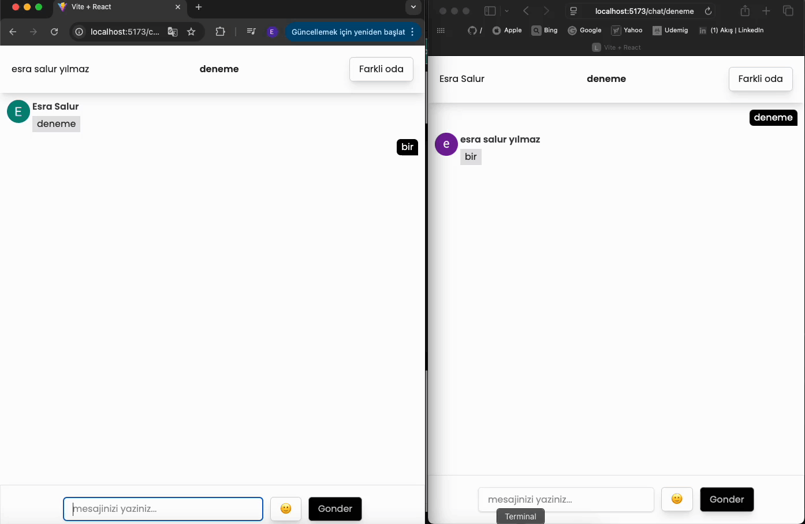

<h2>New Project: Real-Time Chat App 💬</h2>

<h5>a real-time chat application built with modern web technologies! It offers a clean and user-friendly messaging experience. 🚀</h5>

<h4>🛠️ Tech Stack:</h4>

<h5>Firebase (Authentication + Realtime Database)</h5>

<h5>TailwindCSS</h5>

<h5>React Router DOM</h5>

<h5>React Toastify</h5>

<h5>Emoji Picker</h5>

<h4>📌 Key Features:</h4>

<h5>✅ Real-time messaging</h5>

<h5>✅ Firebase-based user authentication</h5>

<h5>✅ Realtime Database for instant message syncing</h5>

<h5>✅ Modern, responsive UI built with TailwindCSS</h5>

<h5>✅ Fun emoji support for better interaction</h5>

<h5>✅ Instant toast notifications for user feedback</h5>

<h5>🧬A user authentication system was implemented to allow users to create accounts and log in securely.</h5>

<h5>💌A real-time database infrastructure was integrated to enable instant messaging between users.</h5>

<h5>⏭️A routing system was set up to manage navigation between different pages in the application.</h5>

<h5>💟Stylish notification pop-ups were used to provide quick feedback to users.</h5>

<h5>🪂The UI was designed using a responsive and modern styling library, ensuring it looks great on all devices.</h5>

<h5>🪁An easy-to-use emoji tool was added so users can include emojis in their messages.</h5>

<h5>💫A fast development tool was used for live preview and enhanced styling during the build process.</h5>

